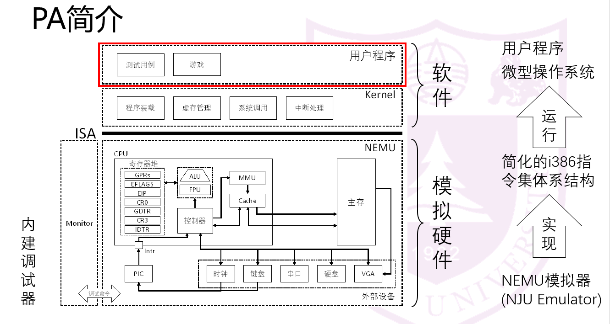

# nju_pa
NJU ICS课程实验PA(Programming Assignment)。

实验目的：实现NEMU，一个简化的i386模拟器。由C语言编写，以用户软件的形态运行，能够执行i386指令集程序。

PA分为四个大的阶段，每个大阶段又拆分为三个小阶段

•PA 1 - 数据的表示、存取和运算

•PA 2 - 程序的执行

•PA 3 - 存储管理

•PA 4 - 异常、中断与I/O